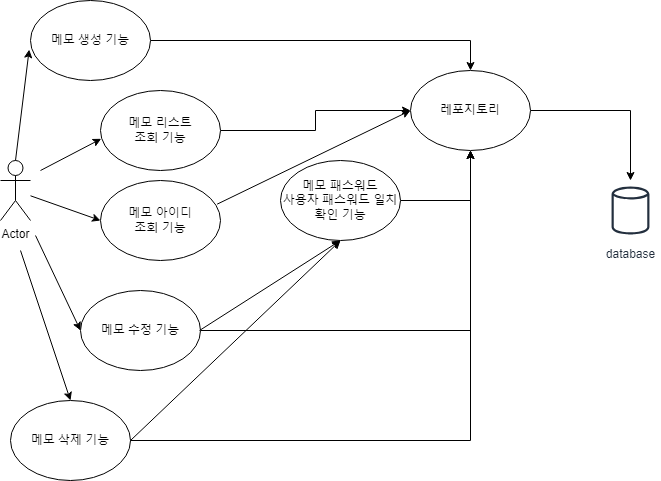

# Lv.1 과제 API

### 목적 
lv1. 과제 구현

## 요구 사항

- [x] 전체 게시글 목록 조회 API

- [x] 게시글 작성 API

- [x] 선택한 게시글 조회 API 

- [x] 선택한 게시글 수정 API

- [x] 선택한 게시글 삭제 API

### 기능 설계
#### 개발 환경, 언어
OS -  Windows home 10

`Java 17`/`SpringBoot`/`JPA`/`Mysql`

#### UseCase


### 구현 API 명세

공통사항

    Host : localhost:8080
    
#### 전체 게시글 목록 조회 API

Request     
  URL

    GET {host}/api/board
    

Response

| key 이름    | value 타입 | 설명   |
|:----------|:---------|:-----|
| id        | Integer  | 메모번호 |
| title     | String   | 제목   |
| writer    | String   | 글쓴이  |
| content   | String   | 내용   |
| createdAt | Date     | 생성일  |

(예시)
```json
[
  {
    "id": 152,
    "title": "title",
    "writer": "hyelin",
    "content": "this is content",
    "createdAt": "2023-08-28T15:28:57.461625"
  },
  {
    "id": 1,
    "title": "new_title4",
    "writer": "hyelin",
    "content": "new_conten4",
    "createdAt": null
  },
  {
    "id": 2,
    "title": "title",
    "writer": "hyelin",
    "content": "this is content",
    "createdAt": null
  },
  {
    "id": 52,
    "title": "title",
    "writer": "hyelin",
    "content": "this is content",
    "createdAt": null
  },
  {
    "id": 102,
    "title": "title",
    "writer": "hyelin",
    "content": "this is content",
    "createdAt": null
  }
]
```
#### 게시글 작성 API

Request     
URL

    GET {host}/api/board/new

Body

Header
```text
Content-Type: application/json
```
```json
{
    "title" : "title",
    "content" : "this is content",
    "password" : "password",
    "writer" : "hyelin"
}
```
Response

| key 이름    | value 타입 | 설명   |
|:----------|:---------|:-----|
| id        | Integer  | 메모번호 |
| title     | String   | 제목   |
| writer    | String   | 글쓴이  |
| content   | String   | 내용   |
| createdAt | Date     | 생성일  |


(에시)

```json
{
  "id": 202,
  "title": "title",
  "writer": "hyelin",
  "content": "this is content",
  "createdAt": "2023-08-28T17:21:03.6672739"
}
```
#### 선택한 게시글 조회 API
Request     
URL

    GET {host}/api/board/{{memo_id}}

| PathParameter 이름 | 타입                        | 설명     |
|:-----------------|:--------------------------|:-------|
| id               | String(Integer formatted) | 메모 아이디 |
Body
Response

| key 이름    | value 타입 | 설명   |
|:----------|:---------|:-----|
| id        | Integer  | 메모번호 |
| title     | String   | 제목   |
| writer    | String   | 글쓴이  |
| content   | String   | 내용   |
| createdAt | Date     | 생성일  |


(에시)

URL

    GET {host}/api/board/152

Response
```json
{
  "id": 152,
  "title": "title",
  "writer": "hyelin",
  "content": "this is content",
  "createdAt": "2023-08-28T15:28:57.461625"
}
```

#### 선택한 게시글 수정 API
Request     
URL

    PUT {host}/api/board/{memo_id}/edit


| PathParameter 이름 | 타입                        | 설명     |
|:-----------------|:--------------------------|:-------|
| id               | String(Integer formatted) | 메모 아이디 |
Header
```text
Content-Type: application/json
```
Body 
```json
{
    "password" : "password",
    "title" : "title_edit",
    "content" : "this is content_changed"
}
```


| key 이름   | value 타입 | 설명  | 필수여부 |
|:---------|:---------|:----|:----:|
| password | String   | 비번  |  **필수**  |
| title    | String   | 제목  |  선택  | 
| content  | String   | 내용  |  선택  |

Response

| key 이름    | value 타입 | 설명   |
|:----------|:---------|:-----|
| id        | Integer  | 메모번호 |
| title     | String   | 제목   |
| writer    | String   | 글쓴이  |
| content   | String   | 내용   |
| createdAt | Date     | 생성일  |


(에시)

```json
{
  "id": 202,
  "writer": "hyelin",
  "title" : "title_edit",
  "content" : "this is content_changed",
  "createdAt": "2023-08-28T17:21:03.6672739"
}
```

#### 선택한 게시글 삭제 API

Request     
URL

    POST {host}/api/board/{{memo_id}}/delete

| PathParameter 이름 | 타입                        | 설명     |
|:-----------------|:--------------------------|:-------|
| id               | String(Integer formatted) | 메모 아이디 |
Body
```json
{
  "password" : "password"
}
```
| key 이름   | value 타입 | 설명   | 필수여부 |
|:---------|:---------|:-----|:----:|
| password | String   | 비밀번호 |  **필수**  |

Response
- 성공 시 
```text
success
```
